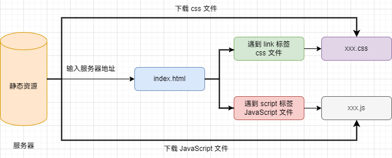
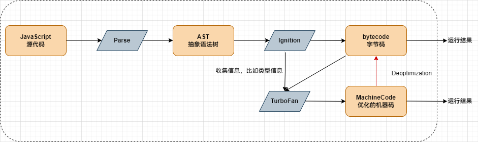

### 代码执行流程

### V8 引擎的原理\*

1. Parse (解析)

   1. 词法分析：逐个分析代码中的字符，生成一个 tokens 数组
   2. 语法分析：生成 AST (抽象语法树)

   > babel、ts -> js、vue template 都是对 AST 进行优化

2. Ignition (解释器)
   1. 根据 AST 生成字节码
3. TurboFan (优化编译器)
   1. 将频繁使用的函数标记为**热点函数**，且将其，提高代码执行性能

### 浏览器渲染过程\*

- 处理  `HTML`  并构建  `DOM`  树
- 处理  `CSS`  构建  `CSSOM`  树
- 将  `DOM`  与  `CSSOM`  合并成一个**渲染树**
- 根据渲染树来布局，计算每个节点的位置
- 调用  `GPU`  绘制，合成图层，显示在屏幕上

:::caution

Js 会阻塞 Dom 解析，除非定义了 `defer` 或者 `async`

:::
