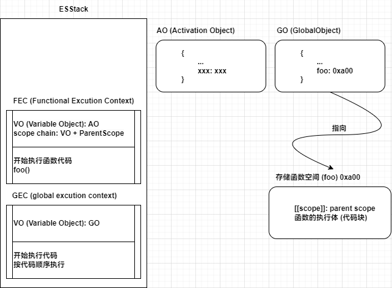

### 浏览器执行流程


### V8 引擎的原理\*


1. Parse (解析)

   1. 词法分析：逐个分析代码中的字符，生成一个 tokens 数组
   2. 语法分析：生成 AST (抽象语法树)

   > babel、ts -> js、vue template 都是对 AST 进行优化

2. Ignition (解释器)
   1. 根据 AST 生成字节码
3. TurboFan (优化编译器)
   1. 将频繁使用的函数标记为**热点函数**，且将其，提高代码执行性能

### JS 执行流程\*\*



- 解析阶段

  - 代码被解析，V8 引擎会创建一个全局对象 **GlobalObject (简称 GO)**
  - 代码中定义的变量也会被放在 **GO** 中，不过现在还是 **undefined**

- 执行阶段
  - 为了执行代码，V8 引擎内部会有一个**Execution Context Stack (ECS/ECStack、执行上下文栈、函数调用栈)**
  - 因为执行的是全局代码，为了全局代码能够正常执行，需要创建 **Global Execution Context (GEC、全局执行上下文)**
    - 内部维护一个 **Variable Object (VO)**，其实就是 GO
    - 然后才开始执行代码...
  - 如果代码中存在函数
    - 会为函数创建一个 **Functional Execution Context (FEC)**
      - 内部也会维护一个 **Variable Object (VO)**，这里是 **Activation Object (AO)**
      - 以及 **scope chain: VO + ParentScope (作用域链)**
    - 在执行完函数后，**FEC** 从 **ECStack** 弹出并销毁
    - **AO** 被销毁

:::tip

在最新的 ECMA 标准中，变量对象 VO 改了一种称呼：变量环境 VE

:::

```javascript
  var name = 'sss';
  var age = 17;
  function foo() {
   console.log("ccc");
  };

  var globalObject = {
  	// String, Date, Number, setTimeout, setInterval...
  	// window: globalObject
   var name = undefined;
   var age = undefined;
  };
```

### 浏览器渲染过程\*

- 处理  `HTML`  并构建  `DOM`  树
- 处理  `CSS`  构建  `CSSOM`  树
- 将  `DOM`  与  `CSSOM`  合并成一个**渲染树**
- 根据渲染树来布局，计算每个节点的位置
- 调用  `GPU`  绘制，合成图层，显示在屏幕上

:::caution

Js 会阻塞 Dom 解析，除非定义了 `defer` 或者 `async`

:::
